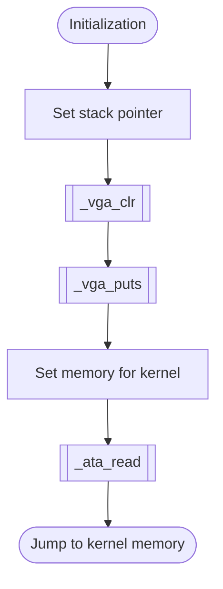
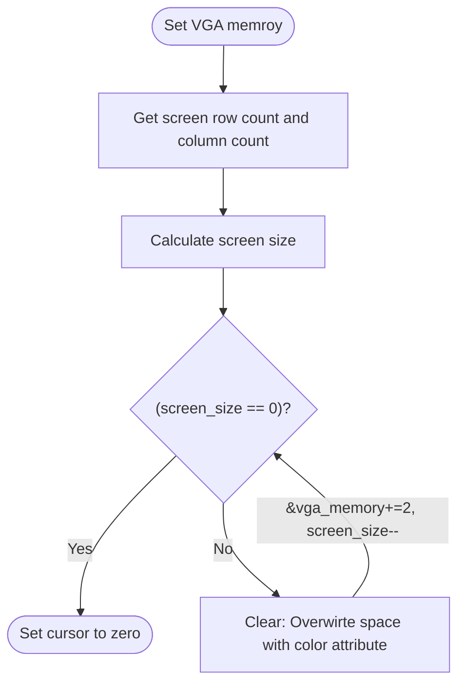
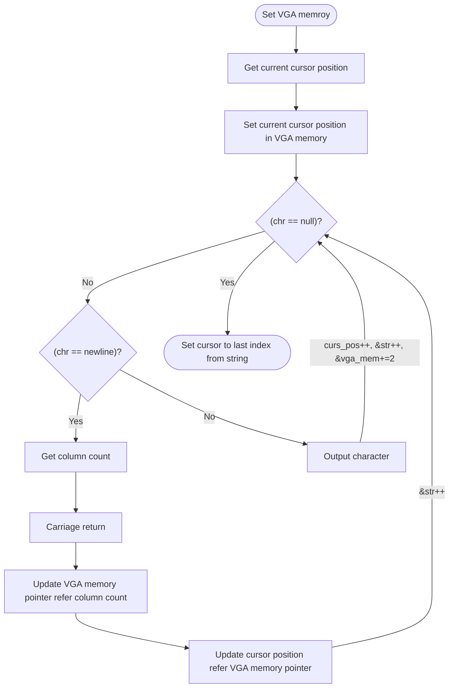
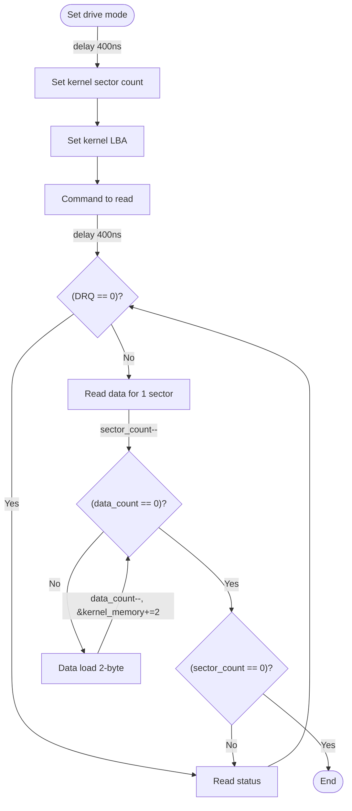

# Boot
## Overview
Bootloader main for Fayos.
Display contol with direct VGA access memory.
Kernel sectors read with ATA PIO mode polling method.
Write the boot signature via linker script.

---

## Table of Contents
- [Module Map](#module-map)
- [Memory Map](#memory-map)
- [Function Reference](#function-reference)
- - [`_start`](#_start)
- - [`_vga_clr`](#_vga_clr)
- - [`_vga_puts`](#_vga_puts)
- - [`_ata_read`](#_ata_read)
- [Notes](#notes)
- [Terms](#terms)
- [Reference Links](#reference-links)

---

## Module Map
| Description | Source Path | Docs Link |
| --- | --- | --- |
| Boot | `/boot/boot.s` | [docs: boot](/docs/boot/boot.md) |
| Boot header | `/boot/boot.inc` | [docs: boot header](/docs/boot_header.md) |
| Boot linker script | `/boot/boot.lds` | [docs: boot linker](#note-linker-script) |

---

## Memory Map
**Base Segment: 0x0000**.
| Memory | Description |
| --- | --- |
| `0x7000-0x7BFF` | Stack memory Stack start `0x7C00`. Supports 1546 stacks. Stack segment always 0. |
| `0x7C00-0x7DFF` | Bootloader memory |
| `0x1000-0x6FFF` | Kernel memory |

---

## Function Reference
### `_start`
#### Overview
Boot entry point.

#### Parameters
- `N/A`

#### Requires
- `N/A`

#### Modifies
- `N/A`

#### Returns
- `N/A`

#### Process Flow

#### Implementation
- Initialization
    - Clear interrupt and clear direction
    - init registers: `ax, ds, es, ss, sp, bp`
    - mandatory to zero: `ds, ss`
- Set stack pointer
    - `sp = 0x7C00`
- Jump to kernel
    - `cs:ip = 0x0000:0x1000`

#### Reference Notes
| Description | Link |
| --- | --- |
| Clear interrupt | [docs: cli](#note-clear-interrupt) |
| Clear Direction | [docs: cld](#note-clear-direction) |
| Stack work | [docs: stack](#note-stack) |

---

### `_vga_clr`
#### Overview
Clear screen.

#### Parameters
- `N/A`

#### Requires
- `N/A`

#### Modifies
- `N/A`

#### Returns
- `N/A`

#### Process Flow

#### Implementation
- Overwirte space to clear
- Default color attribute: background=black, foreground=lightgray
- `screen_size = row_count * column_count`
    - `row_count = row_last_index + 1`

---

### `_vga_puts`
#### Overview
Put string in VGA.

#### Parameters
1. `ub8 *str`

#### Requires
- `N/A`

#### Modifies
- `N/A`

#### Returns
- `N/A`

#### Process Flow

#### Implementation
- Default color attribute: background=black, foreground=lightgray

---

### `_ata_read`
#### Overview
Read sectors for kernel. Implements PIO mode, polling method.

#### Parameters
- `N/A`

#### Requires
- `N/A`

#### Modifies
- `N/A`

#### Returns
- `N/A`

#### Process Flow

#### Implementation
- Drive master and LBA mode
- PIO mode
- Polling

#### Reference Notes
| Description | Link |
| --- | --- |
| Why delay 400ns | [docs: ata delay 400ns](/docs/drv/ata.md#note-delay-400ns) |

---

## Notes
### Note Linker Script
Output format is binary and architecture is i386.
Set entry name `_start`.
Set start section is `0x7C00`. Sections layout `text, rodata, data, bss`. And set position `0x7DFE` for last 2-byte in bootloader, Insert boot signiture `0xAA55`.

### Note Clear Direction
- Q. Why use?
- A. More safely and explicitly. Using command `cld` in boot. Direction flag effect for related string command.

### Note Clear Interrupt
Disable interrupt in bootloader. And enable interrupt when initialization logic end.

### Note Stack
Example: `sp = 0x7C00`.
The `push %ax` stack pointer auto decrease 2-byte `sp = 0x7BFE`. So `(0x7BFE) = ax value`.
The `pop %ax` get value and current stack pointer auto increase 2-byte.
If nessless `ax` value, Manualy add 2-byte to stack pointer for clean like `add $0x02, %sp` instead of `pop`.

---

## Terms
| Name | Description |
| --- | --- |
| ATA | Advanced Technology Attachement |
| VGA | Video Graphic Array |
| LDS | Link Editor Script |
| RODATA | Read Only Data |
| BSS | Block Started by Symbol |
| CLD | Clear Direction |
| CLI | Clear Interrupt |
| LBA | Logical Block Address |
| MA | Master |
| DRQ | Data Request |
| BG | Backgroud |
| FG | Foreground |

---

## Reference Links
| Description | Link |
| --- | --- |
| Directory doucment for boot | [docs: boot](/docs/boot/README.md) |
| Document for ATA | [docs: ata](/docs/drv/ata.md) |
| Document for VGA | [docs: vga](/docs/drv/vga.md) |
| Document for Fayos | [docs: fayos](/docs/README.md) |

---

> Authors 2025-2026 Facooya and Fanone Facooya
