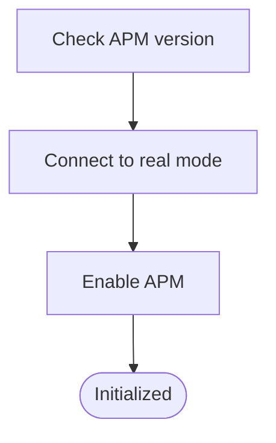
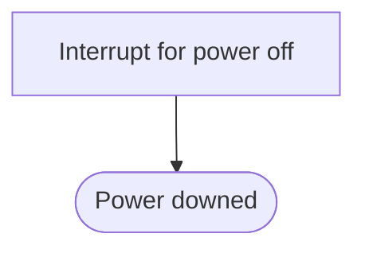

# APM Driver
## Overview
Power interface.

**Implementation**
- BIOS interrupt

---

## Table of Contents
- [Module Map](#module-map)
- [Data Reference](#data-reference)
- [Function Reference](#function-reference)
- - [`apm_init`](#apm_init)
- - [`apm_off`](#apm_off)
- [Terms](#terms)
- [Reference Links](#reference-links)

---

## Module Map
| Description | Source Path | Docs Link |
| --- | --- | --- |
| Main | `/drv/apm.s` | [docs: apm](/docs/drv/apm.md) |
| Header | `/inc/drv/apm.inc` | [docs: apm header](docs/inc/drv/apm_header.md) |

---

## Data Reference
| Name | Description |
| --- | --- |
| `_emsg_cmd_fail` | Error message for poweroff command failure |
| `_emsg_apm_no` | Error message for check version step |
| `_emsg_apm_conn` | Error message for connect step |
| `_emsg_apm_enable` | Error message for enable step |

---

## Function Reference
### `apm_init`
#### Overview
Initialize.

#### Parameters
- `N/A`

#### Requires
- `_emsg_apm_no`
- `_emsg_apm_conn`
- `_emsg_apm_enable`

#### Modifies
- `N/A`

#### Returns
- `N/A`

#### Process Flow

#### Implementation
- BIOS interrupt

---

### `apm_off`
#### Overview
Power off.

#### Parameters
- `N/A`

#### Requires
- `_emsg_cmd_fail`

#### Modifies
- `N/A`

#### Returns
- `N/A`

#### Process Flow

#### Implementation
- BIOS interrupt

---

## Terms
| Name | Description |
| --- | --- |
| APM | Advanced Power Management |

---

## Reference Links
| Description | Link |
| --- | --- |
| APM Header | [docs: apm header](/docs/inc/drv/apm_header.md) |
| External link: standard APM document | [OSDev: apm](https://wiki.osdev.org/APM) |

---

> Authors 2026 Facooya and Fanone Facooya
