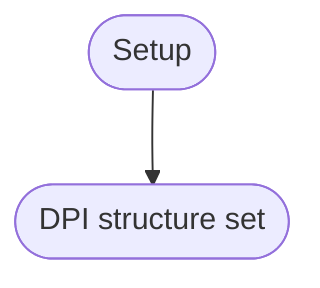
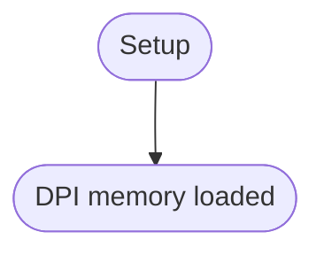
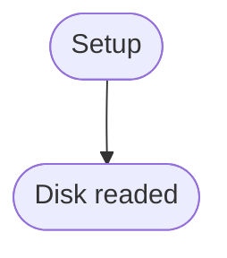
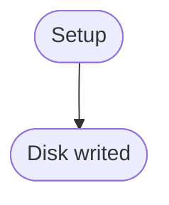

# Disk Driver
## Overview
Upper storage device interface.
Base the ATA.

---

## Table of Contents
- [Module Map](#module-map)
- [Data Reference](#data-reference)
- [Function Reference](#function-reference)
- - [`disk_set_dpi`](#disk_set_dpi)
- - [`disk_load_dpi`](#disk_load_dpi)
- - [`disk_read_dpi`](#disk_read_dpi)
- - [`disk_write_dpi`](#disk_write_dpi)
- - [`disk_read_fsp`](#disk_read_fsp)
- - [`disk_write_fsp`](#disk_write_fsp)
- [Terms](#terms)
- [Reference Links](#reference-links)

---

## Module Map
| Description | Source Path | Docs Link |
| --- | --- | --- |
| Main | `/drv/disk.s` | [docs: disk](/docs/drv/disk.md) |
| Header | `/inc/drv/disk.inc` | [docs: disk header](/docs/inc/drv/disk_header.md) |

---

## Data Reference
| Name | Size | Description |
| --- | --- | --- |
| `dpi` | 0x100 | Immutable disk packet array. Disk packets in DPI array. |

**DP in DPI**
| Name | Size | Description |
| --- | --- | --- |
| Sector Count | 2 | Sector count |
| Memory | 4 | Segment and offset |
| LBA | 2 | Logical Block Address |

---

## Function Reference
### `disk_set_dpi`
#### Overview
Set DPI for read/write disk DPI functions. Set DPI refer superblock.

#### Parameters
- `N/A`

#### Requires
- superblock have DPI

#### Modifies
- `dpi`

#### Returns
- `N/A`

#### Process Flow

#### Implementation
- Set order
    - superblock
    - block bitmap
    - inum bitmap
    - inode table

#### Reference Notes
| Description | Link |
| --- | --- |
| DPI information in superblock | [docs: `_sb_write_dpi`](/docs/fs/superblock.md#_sb_write_dpi) |

---

### `disk_load_dpi`
#### Overview
Disk load memory for fast access in DPI.

#### Parameters
- `N/A`

#### Requires
- `dpi`

#### Modifies
- `N/A`

#### Returns
- `N/A`

#### Process Flow

#### Implementation
- Load order
    - superblock
    - block bitmap
    - inum bitmap
    - inode table

---

### `disk_read_dpi`
#### Overview
Read disk refer from DPI structure.

#### Parameters
1. `dpi *src`

#### Requires
- `N/A`

#### Modifies
- `N/A`

#### Returns
- `dx:ax = seg:off`

#### Process Flow

---

### `disk_write_dpi`
#### Overview
Write disk refer from DPI structure.

#### Parameters
1. `dpi *src`

#### Requires
- `N/A`

#### Modifies
- `N/A`

#### Returns
- `dx:ax = seg:off`

#### Process Flow

---

### `disk_read_fsp`
#### Overview
Read disk refer from FSP structure.

#### Parameters
1. `fsp *src`

#### Requires
- `N/A`

#### Modifies
- `N/A`

#### Returns
- `dx:ax = seg:off`

#### Process Flow

---

### `disk_write_fsp`
#### Overview
Write disk refer from FSP structure.

#### Parameters
1. `fsp *src`

#### Requires
- `N/A`

#### Modifies
- `N/A`

#### Returns
- `dx:ax = seg:off`

#### Process Flow

---

## Terms
| Name | Description |
| --- | --- |
| ATA | Advanced Technology Attachement |
| DP | Disk Packet |
| DPI | Disk Packet Immutable |
| FSP | File System Packet |
| SB | Superblock |
| BBM | Block Bitmap |
| IBM | Inum Bitmap |
| IT | Inode Table |
| LBA | Logical Block Address |
| PAR | Parent |
| CUR | Current |

---

## Reference Links
| Description | Link |
| --- | --- |
| Main document for ATA | [docs: ata](/docs/drv/ata.md) |

---

> Authors 2025-2026 Facooya and Fanone Facooya
