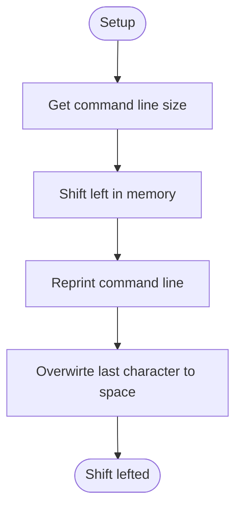
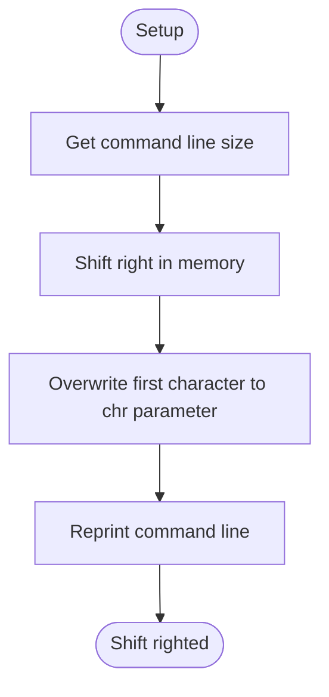

# Display Driver
## Overflow
Upper video interface.
Base the VGA.

---

## Table of Contents
- [Module Map](#module-map)
- [Function Reference](#function-reference)
- - [`disp_shl_cl`](#disp_shl_cl)
- - [`disp_shr_cl`](#disp_shr_cl)
- [Terms](#terms)
- [Reference Links](#reference-links)

---

## Module Map
| Description | Source Path | Docs Link |
| --- | --- | --- |
| Display | `/drv/display.s` | [docs: display](/docs/drv/display.md) |

---

## Function Reference
### `disp_shl_cl`
#### Overview
Screen shift left in command line.

#### Parameters
1. `ub8 *data`
    - string type
    - point to `current_cursor_position - 1` in command line

#### Requires
- `N/A`

#### Modifies
- `N/A`

#### Returns
- `N/A`

#### Process Flow

---

### `disp_shr_cl`
#### Overview
Screen shift right in command line.

#### Parameters
1. `ub8 *data`
    - string type
    - point to `current_cursor_position + 1` in command line
1. `ub8 chr`
    - insert character to `current_cursor_position`

#### Requires
- `N/A`

#### Modifies
- `N/A`

#### Returns
- `N/A`

#### Process Flow

---

## Terms
| Name | Description |
| --- | --- |
| DISP | Display |
| VGA | Video Graphic Array |
| SHR | Shift Right |
| SHL | Shift Left |
| CL | Command Line |

---

## Reference Links
| Description | Link |
| --- | --- |
| Main document for VGA | [docs: vga](/docs/drv/vga.md) |

---

> Authors 2025-2026 Facooya and Fanone Facooya
