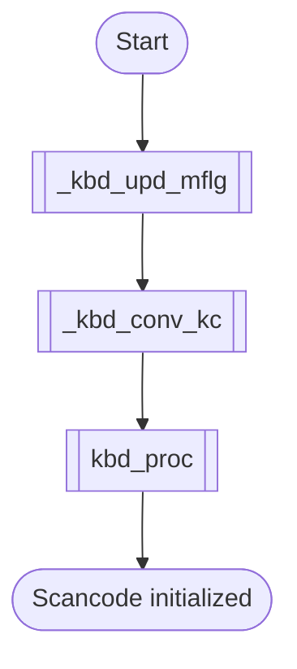
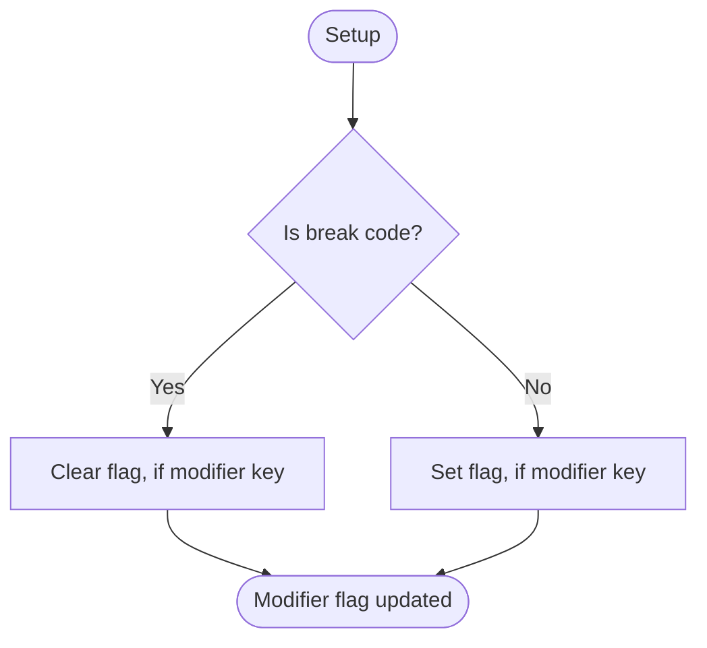
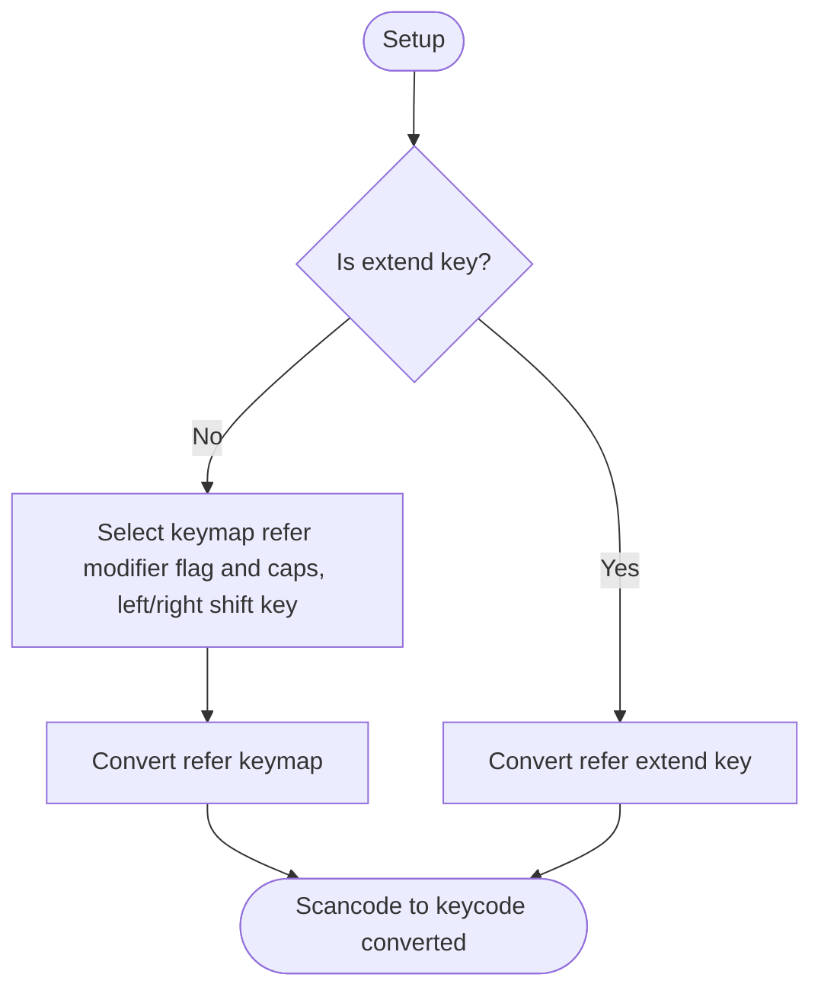
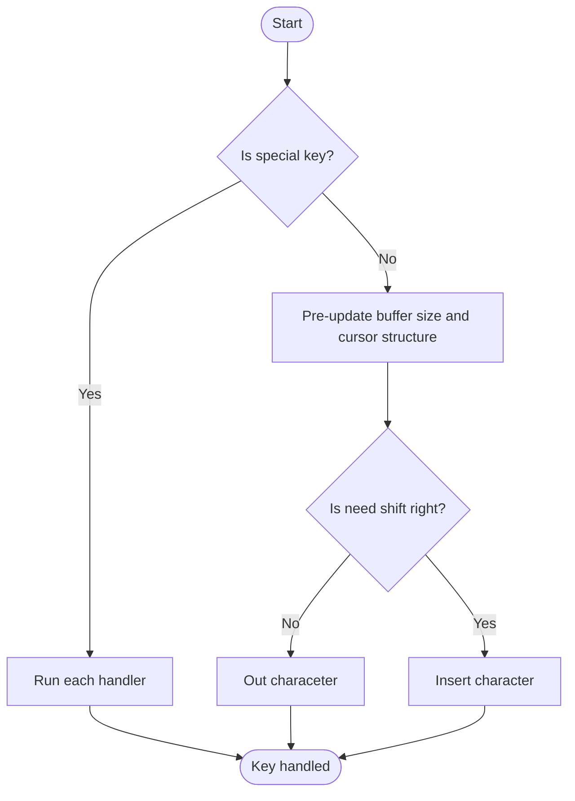
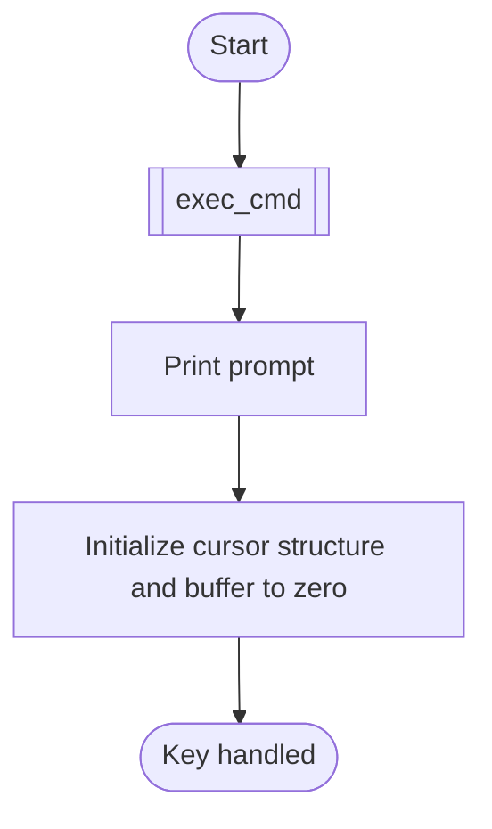
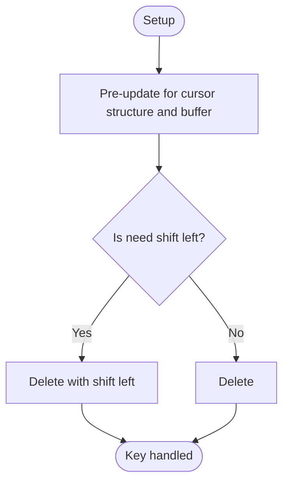
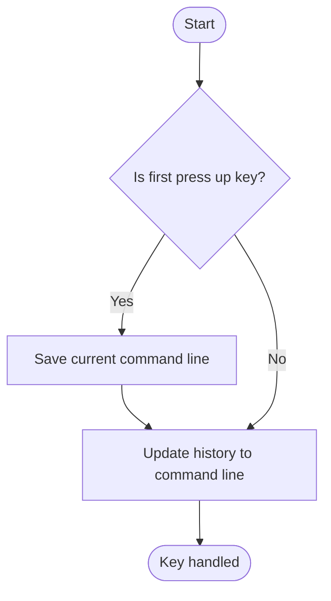
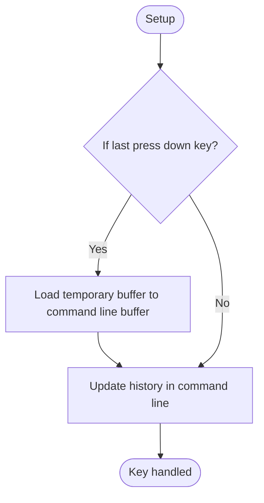
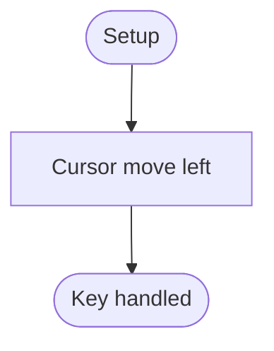
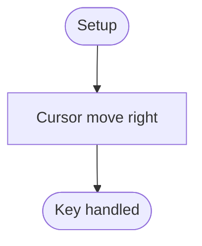

# Keyboard Driver
## Overview
Upper PS2 interface.
Invoke keyboard driver scan code full in kernel main loop, Scan code full by PS2 interrupt.

---

## Table of Contents
- [Module Map](#module-map)
- [Data Reference](#data-reference)
- [Function Reference](#function-reference)
- - [`kbd_run`](#kbd_run)
- - [`_kbd_upd_mflg`](#_kbd_upd_mflg)
- - [`_kbd_conv_kc`](#_kbd_conv_kc)
- - [`_kbd_proc`](#_kbd_proc)
- - [`_kbd_hdl_cr`](#_kbd_hdl_cr)
- - [`_kbd_hdl_bs`](#_kbd_hdl_bs)
- - [`_kbd_hdl_up`](#_kbd_hdl_up)
- - [`_kbd_hdl_down`](#_kbd_hdl_down)
- - [`_kbd_hdl_left`](#_kbd_hdl_left)
- - [`_kbd_hdl_right`](#_kbd_hdl_right)
- [Terms](#terms)
- [Reference Links](#reference-links)

---

## Module Map
| Description | Source Path | Docs Link |
| --- | --- | --- |
| Keyboard header | `/inc/drv/kbd.inc` | [docs: keyboard header](/docs/inc/drv/kbd_header.md) |
| Keyboard | `/drv/keyboard.s` | [docs: keyboard](/docs/drv/keyboard.md) |

---

## Data Reference
| Name | Description |
| --- | --- |
| `_kbd_mflg` | Modifier key flag. Size 2-byte. |
| `_kbd_keymap` | Keymap for scancode convert to keycode. |
| `_kbd_keymap_shf` | Keymap shift key pressed for scancode convert to keycode |

---

## Function Reference
### `kbd_run`
#### Overview
Call only in kernel main loop.

#### Parameters
- `N/A`

#### Requires
- `N/A`

#### Modifies
- `scancode`

#### Returns
- `N/A`

#### Process Flow

---

### `_kbd_upd_mflg`
#### Overview
Modifier key flag set/clear function. Flag size is 2-byte.

#### Parameters
- `N/A`

#### Requires
- `N/A`

#### Modifies
- `scancode`
- `kbd_mflg`

#### Returns
- `ax = {0:skip}`

#### Process Flow

---

### `_kbd_conv_kc`
#### Overview
Convert scancode to keycode.

#### Parameters
- `N/A`

#### Requires
- `scancode`
- `kbd_mflg`

#### Modifies
- `N/A`

#### Returns
- `al = keycode`

#### Process Flow

---

### `_kbd_proc`
#### Overview
Normal keycode handler and special key dispatcher.

#### Parameters
- `N/A`

#### Requires
- `al = keycode`

#### Modifies
- `cl_sbuf`
- `curs`

#### Returns
- `N/A`

#### Process Flow

---

### `_kbd_hdl_cr`
#### Overview
Keryboard handler for carrage return (enter) key.

#### Parameters
- `N/A`

#### Requires
- `N/A`

#### Modifies
- `cl_sbuf`

#### Returns
- `si = &cl_sbuf.data`

#### Process Flow

---

### `_kbd_hdl_bs`
#### Overview
Keryboard handler for backspace key.

#### Parameters
- `N/A`

#### Requires
- `si = &cl_sbuf.data + index`

#### Modifies
- `cl_sbuf`
- `curs`

#### Returns
- `si = {normal: &cl_sbuf.data + index - 1}, {skip: &cl_sbuf.data + index}`

#### Process Flow

---

### `_kbd_hdl_up`
#### Overview
Keyboard handler for up arrow key. Related history function.

#### Parameters
- `N/A`

#### Requires
- `file_lines`

#### Modifies
- `cl_sbuf`
- `cl_hist_sbuf`
- `hist_idx`

#### Returns
- `si = &cl_sbuf.data + last_index`

#### Process Flow

---

### `_kbd_hdl_down`
#### Overview
Keyboard handler for down arrow key. Related history function.

#### Parameters
- `N/A`

#### Requires
- `cl_hist_sbuf`
- `file_lines`

#### Modifies
- `cl_sbuf`
- `hist_idx`
- `curs`

#### Returns
- `si = &cl_sbuf.data + last_index`

#### Process Flow

---

### `_kbd_hdl_left`
#### Overview
Keyboard handler for left arrow key.

#### Parameters
- `N/A`

#### Requires
- `si = &cl_sbuf + index`
- `curs`

#### Modifies
- `N/A`

#### Returns
- `si = {normal: &cl_sbuf + index - 1}, {skip: &cl_sbuf + index}`

#### Process Flow

---

### `_kbd_hdl_right`
#### Overview
Keyboard handler for right arrow key.

#### Parameters
- `N/A`

#### Requires
- `si = &cl_sbuf + index`
- `curs`

#### Modifies
- `N/A`

#### Returns
- `si = {normal: &cl_sbuf + index + 1}, {skip: &cl_sbuf + index}`

#### Process Flow

---

## Terms
| Name | Description |
| --- | --- |
| PS2 | Personal System 2 |
| SC | Scan Code |
| KC | Key Code |
| MFLG | Modifier Flag |

---

## Reference Links
| Description | Link |
| --- | --- |
| Main document for PS2 | [docs: ps2](/docs/drv/ps2.md) |
| Main document for driver | [docs: driver](/docs/drv/README.md) |
| Standard document for keyboard (External Link) | [OSDev: keyboard](https://wiki.osdev.org/PS/2_Keyboard) |

---

> Authors 2025-2026 Facooya and Fanone Facooya
