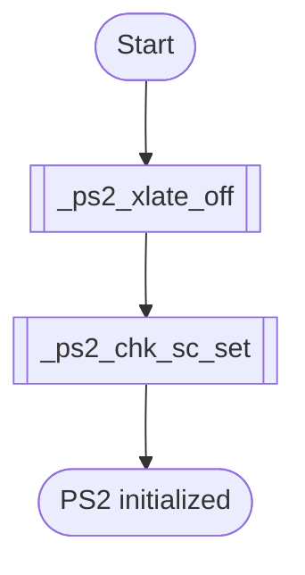
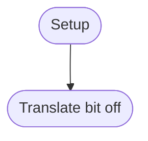
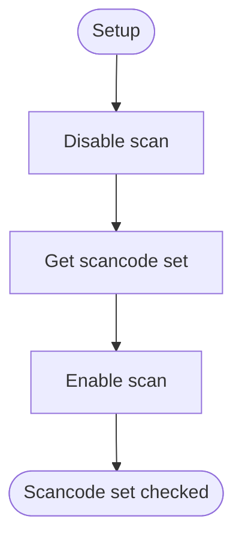

# PS2 Driver
## Overview
Lower keyboard interface.

**Implementation**
- Interrupt
- Translate off
- Scan code set 2

---

## Table of Contents
- [Module Map](#module-map)
- [Register Map](#register-map)
- [Function Reference](#function-reference)
- - [`ps2_init`](#ps2_init)
- - [`_ps2_xlate_off`](#_ps2_xlate_off)
- - [`_ps2_chk_sc_set`](#_ps2_chk_sc_set)
- [Notes](#notes)
- [Terms](#terms)
- [Reference Links](#reference-links)

---

## Module Map
| Description | Link |
| --- | --- |
| PS2 | [docs: ps2](/docs/drv/ps2.md) |
| PS2 Header | [docs: ps2 header](/docs/inc/drv/ps2_header.md) |
| PS2 interrupt service routine | [docs: ps2 isr](/docs/int/isr.md#isr_ps2) |

---

## Register Map
**Port**
| Name | Port | Byte | Mode |
| :--- | :---: | :---: | :---: |
| Data | 0x60 | 1 | IO |
| Status | 0x64 | 1 | IN |
| Command | 0x64 | 1 | OUT |

**Status**
| Bit | Name | Value | Description |
| :---: | --- | --- | --- |
| 0 | Output Buffer Full | 0=empty, 1=full | 1 is ready to read data or command. |
| 1 | Input Buffer Full | 0=empty, 1=full | 0 is ready to write data or command. |

**Configuration Byte**
| Bit | Name | Value | Description |
| :---: | --- | --- | --- |
| 6 | Configuration translation | 0=disable, 1=enable | Translation bit in configuration byte. If translate enable scan code set 2 convert to scan code set 1. |

---

## Function Reference
### `ps2_init`
#### Overview
PS2 initialization. Turn off translate bit and check scan code set is 2.

#### Parameters
- `N/A`

#### Requires
- `cli` - Disable interrupt

#### Modifies
- `N/A`

#### Returns
- `N/A`

#### Process Flow

---

### `_ps2_xlate_off`
#### Overview
Turn off translation bit in configuration byte. Translation bit is translate scan code set 2 to scan code set 1. Fayos using scan code set 2, Turn off translation bit.

#### Parameters
- `N/A`

#### Requires
- `cli` - Disable interrupt

#### Modifies
- `N/A`

#### Returns
- `N/A`

#### Process Flow

---

### `_ps2_chk_sc_set`
#### Overview
Check scan code set is 2. Generally keyboard using scan code set 2.

#### Parameters
- `N/A`

#### Requires
- `cli` - Disable interrupt

#### Modifies
- `N/A`

#### Returns
- `N/A`

#### Process Flow

#### Reference Notes
| Description | Link |
| --- | --- |
| What is data command | [docs: ps2 data command](#note-data-command) |

---

## Notes
### Note Data Command
- Q. What is data command?
- A. Normal command into I8042 chip. But data command into device.

---

## Terms
| Name | Description |
| --- | --- |
| PS2 | Personal System 2 |
| OBF | Output Buffer Full |
| IBF | Input Buffer Full |
| SC | Scancode |
| SCF | Scancode Flag |
| SCS | Scancode Set |
| KC | Keycode |
| XLATE | Translate |

---

## Reference Links
| Description | Link |
| --- | --- |
| Keyboard driver | [docs: keyboard](/docs/drv/keyboard.md) |
| Main document for driver | [docs: driver](/docs/drv/README.md) |
| External link: PS2 standard document | [OSDev: ps2](https://wiki.osdev.org/I8042_PS/2_Controller) |

---

> Authors 2025-2026 Facooya and Fanone Facooya
