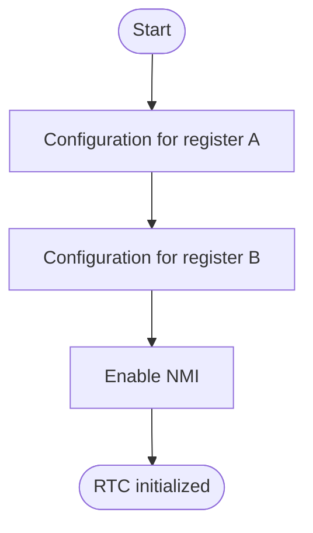
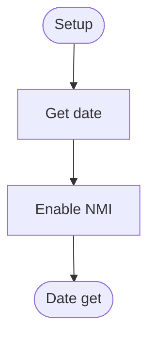

# RTC Driver
## Overview
Lower time interface.
1024 ticks are equal 1 second.

**Implementation**
- UIP: Update In Progress
- PIE: Periodic Interrupt Enable

**Register A**
- Divider: 32.768 kHz
- Rate: 1024 Hz

**Register B**
- Time format: 24 Hours
- Data mode: Binary

---

## Table of Contents
- [Module Map](#module-map)
- [Register Map](#register-map)
- [Function Reference](#function-reference)
- - [`rtc_init`](#rtc_init)
- - [`rtc_get`](#rtc_get)
- [Notes](#notes)
- [Terms](#terms)
- [Reference Links](#reference-links)

---

## Module Map
| Description | Source Path | Docs Link |
| --- | --- | --- |
| RTC | `/drv/rtc.s` | [docs: rtc](/docs/drv/rtc.md) |
| RTC header | `/inc/drv/rtc.inc` | [docs: rtc header](/docs/inc/drv/rtc_header.md) |
| RTC interrupt service routine | `/int/isr_rtc.s` | [docs: isr rtc](/docs/int/isr.md#isr_rtc) |

---

## Register Map
**Port**
| Name | Port | Byte | Mode |
| :--- | :---: | :---: | :---: |
| Address | 0x70 | 1 | OUT |
| Data | 0x71 | 1 | IO |

**Address**
| Bit | Name | Value | Description |
| :---: | --- | --- | --- |
| 0-6 | Second | 0x00 | Second, 0-59 |
| 0-6 | Minute | 0x02 | Minute, 0-59 |
| 0-6 | Hour | 0x04 | Hour, 0-23 |
| 0-6 | Week | 0x06 | Day of week, 1=SUN, ... 7=SAT in binary mode |
| 0-6 | Day | 0x07 | Day of month, 1-31 |
| 0-6 | Month | 0x08 | 1-12 |
| 0-6 | Year | 0x09 | If 2025 return 25 |
| 0-6 | Register A | 0x0A | Configuration UIP, DV, RS |
| 0-6 | Register B | 0x0B | Configuration TF, DM, PIE |
| 0-6 | Register C | 0x0C | Interrupt flag, Read to clear |
| 0-6 | Register D | 0x0D | Only for NMI enable |
| 7 | Non-Maskable Interrupt | 0=enable, 1=disable | Protect data from NMI. Using like `REG_A|NMI` is access register A with NMI disable. |

**Register A**
| Bit | Name | Value | Description |
| :---: | --- | --- | --- |
| 0-3 | Rate Selector | 0b0110 [1024 Hz] | 1024 ticks are equal 1 second |
| 4-6 | Divider | 0b010 [32.768 kHz] | Divider |
| 7 | Update In Progress | 0=safe, 1=updating | Update In Progress |

**Register B**
| Bit | Name | Value | Description |
| :---: | --- | --- | --- |
| 1 | Time Format | 0=12H, 1=24H | Set 24 Hours |
| 2 | Data Mode | 0=Binaray Code Decimal, 1=binaray | Set binaray for calculation |
| 6 | Periodic Interrupt Enable | 0=disable, 1=enable | Set 1 for interrupt |

**Register C**
| Bit | Name | Value | Description |
| :---: | --- | --- | --- |
| 6 | Periodic interrupt flag | 0=false, 1=true | Configuration from Register B, Set bit every ticks, Read to clear bit |

---

## Function Reference
### `rtc_init`
#### Overview
Modifiy register A and configuration register B. 24 Hours and binary and PIE enable.

#### Parameters
- `N/A`

#### Requires
- `cli` - Disable interrupt

#### Modifies
- `N/A`

#### Returns
- `N/A`

#### Process Flow

#### Reference Notes
| Description | Link |
| --- | --- |
| Why disable NMI | [docs: rtc nmi](#note-nmi) |

---

### `rtc_get`
#### Overview
RTC get date using port. And save values `rtc_date`. It will excute once every day or every boot.

#### Parameters
- `N/A`

#### Requires
- `cli` - Disable interrupt

#### Modifies
- `rtc_date`

#### Returns
- `N/A`

#### Process Flow

#### Reference Notes
| Description | Link |
| --- | --- |
| Why disable NMI | [docs: rtc nmi](#note-nmi) |

---

## Notes
### note-nmi
NMI: Non-Maskable Interrupt
- Q. Why set?
- A. Set is disable for NMI bit. RTC process is address write after read/write data. If address value is 0x00 (second), Address value write done, Now read/wrie data. But trigger NMI interrupt. It can change address value. So protect address port before read/write data from NMI.
- Q. How to use?
- A. Address port out before using `or`. Example, `REG_A|NMI` This is `0x0A or 0x80 = 0x8A`. Finally address value is 0x8A. This mean is Access register A with disable NMI bit.

---

## Terms
| Name | Description |
| --- | --- |
| RTC | Real Time Clock |
| NMI | Non-Maskable Interrupt |
| BCD | Binary Code Decimal |
| UIP | Update In Progress |
| PIE | Perodic Interrup Enable |
| DV | Divider |
| RS | Rate Selector |
| TF | Time Format |
| DM | Data Mode |

---

## Reference Links
| Description | Link |
| --- | --- |
| Time driver | [docs: time](/docs/drv/time.md) |
| Main document for driver | [docs: driver](/docs/drv/README.md) |
| External link, RTC standard document | [OSDev: rtc](https://wiki.osdev.org/RTC) |

---

> Authors 2025-2026 Facooya and Fanone Facooya
