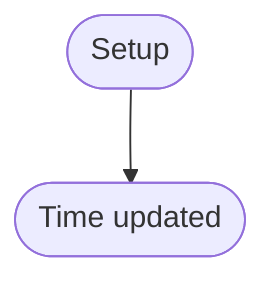

# Time Driver
## Overview
Upper time interface.

---

## Table of Contents
- [Module Map](#module-map)
- [Function Reference](#function-reference)
- - [`time_upd`](#rtc_init)
- [Terms](#terms)
- [Reference Links](#reference-links)

---

## Module Map
| Description | Source Path | Docs Link |
| --- | --- | --- |
| Time | `/drv/time.s` | [docs: time](/docs/drv/time.md) |

---

## Function Reference
### `time_upd`
#### Overview

#### Parameters
- `N/A`

#### Requires
- `N/A`

#### Modifies
- `rtc_date`

#### Returns
- `N/A`

#### Process Flow

---

## Terms
| Name | Description |
| --- | --- |
| RTC | Real Time Clock |

---

## Reference Links
| Description | Link |
| --- | --- |
| RTC driver | [docs: rtc](/docs/drv/rtc.md) |
| Main document for driver | [docs: driver](/docs/drv/README.md) |

---

> Authors 2025-2026 Facooya and Fanone Facooya
