# VGA Driver
## Overview
Lower video interface.

---

## Table of Contents
- [Module Map](#module-map)
- [Register Map](#register-map)
- [Data Reference](#data-reference)
- [Function Reference](#function-reference)
- - [`vga_init`](#vga_init)
- - [`vga_clr`](#vga_clr)
- - [`vga_clr_line`](#vga_clr_line)
- - [`vga_init_curs`](#vga_init_curs)
- - [`vga_get_curs`](#vga_get_curs)
- - [`vga_set_curs`](#vga_set_curs)
- - [`vga_outc`](#vga_outc)
- - [`vga_outs`](#vga_outs)
- - [`vga_outns`](#vga_outns)
- - [`vga_shu`](#vga_shu)
- - [`vga_shd`](#vga_shd)
- - [`_vga_sl_tb`](#_vga_sl_tb)
- [Notes](#notes)
- [Terms](#terms)
- [Reference Links](#reference-links)

---

## Module Map
| Description | Source Path | Docs Link |
| --- | --- | --- |
| Header | `/inc/drv/vga.inc` | [docs: vga header](/docs/inc/drv/vga_header.md) |
| Main | `/drv/vga.s` | [docs: vga](/docs/drv/vga.md) |

---

## Register Map
**Port**
| Name | Port | Byte | Mode |
| :--- | :---: | :---: | :---: |
| `VGA_PORT_CURS_CMD` | 0x03D4 | 1 | OUT |
| `VGA_PORT_CURS_DATA` | 0x03D5 | 1 | IO |

**Address**
| Name | Port | Byte | Mode |
| :--- | :---: | :---: | :---: |
| `VGA_ADDR_ROW` | 0x0484 | 1 | IN |
| `VGA_ADDR_COL` | 0x044A | 2 | IN |

---

## Data Reference
| Name | Description |
| --- | --- |
| `_vga_size` | Entire screen size |
| `_vga_last_row_off` | Last row start offset |

---

## Function Reference
### `vga_init`
#### Overview
Initialize VGA.

#### Parameters
- `N/A`

#### Requires
- `N/A`

#### Modifies
- `_vga_last_row_off`
- `_vga_size`

#### Returns
- `N/A`

#### Process Flow
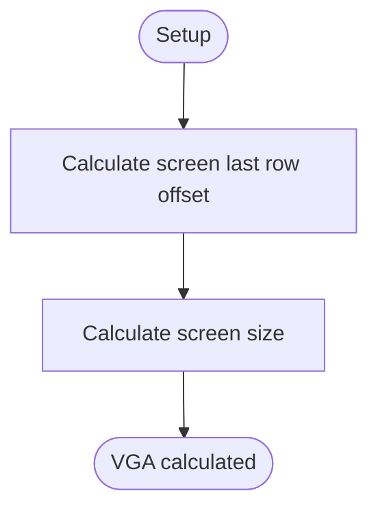

#### Reference Notes
| Description | Link |
| --- | --- |
| How to calculate size? | [docs: vga](#note-vga-size) |

---

### `vga_clr`
#### Overview
Clear for entire screen.

#### Parameters
- `N/A`

#### Requires
- `_vga_size`

#### Modifies
- `N/A`

#### Returns
- `N/A`

#### Process Flow
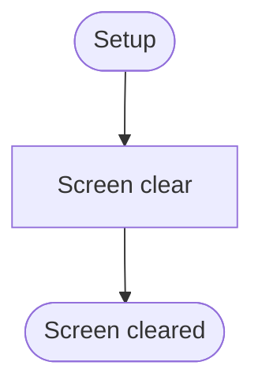

#### Implementation
- Color attribute
    - background = black
    - foreground = lightgray

---

### `vga_clr_line`
#### Overview
Clear line for current cursor position.

#### Parameters
- `N/A`

#### Requires
- `N/A`

#### Modifies
- `N/A`

#### Returns
- `N/A`

#### Process Flow
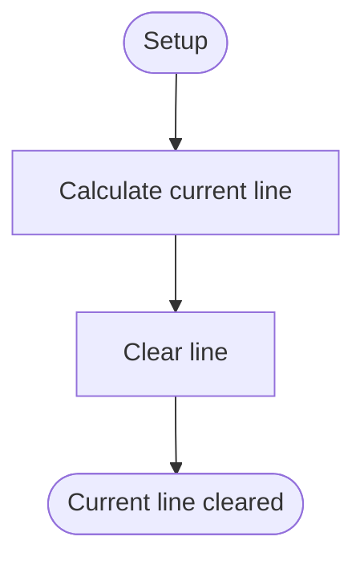

#### Implementation
- Color attribute
    - background = black
    - foreground = lightgray
- Calculate current line
    - `current_line_idx = curs_pos / column`
    - `current_line_start_pos = line_idx * column`

---

### `vga_init_curs`
#### Overview
Initialization cursor structure refer for current cursor position.

#### Parameters
- `N/A`

#### Requires
- `N/A`

#### Modifies
- `curs`

#### Returns
- `N/A`

#### Process Flow
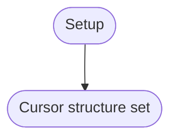

---

### `vga_get_curs`
#### Overview
Get current cursor position.

#### Parameters
- `N/A`

#### Requires
- `N/A`

#### Modifies
- `N/A`

#### Returns
- `ax = pos`
    - `pos / COLUMN = y`
    - `pos % COLUMN = x`

#### Process Flow
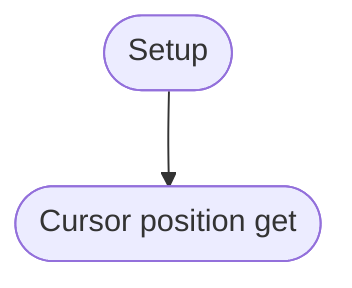

---

### `vga_set_curs`
#### Overview
Set cursor position.

#### Parameters
1. `ub16 pos`

#### Requires
- `N/A`

#### Modifies
- `N/A`

#### Returns
- `N/A`

#### Process Flow
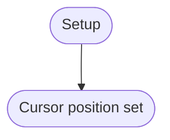

---

### `vga_outc`
#### Overview
Out character to screen.

#### Parameters
- `N/A`

#### Requires
- `al = character`
- `_vga_size`
- `_vga_last_row_off`

#### Modifies
- `N/A`

#### Returns
- `N/A`

#### Process Flow
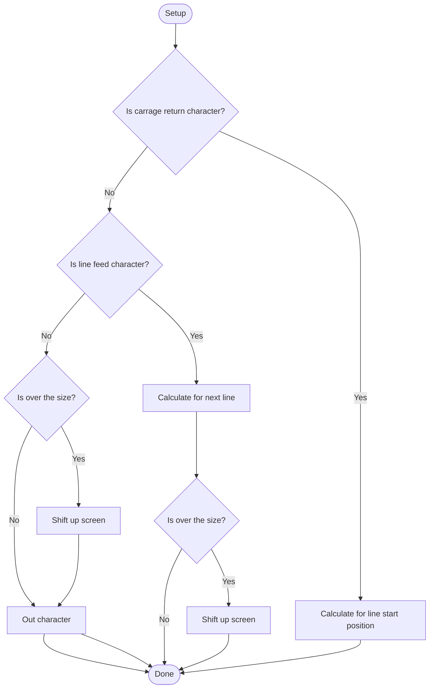

#### Implementation
- Color attribute
    - background = black
    - foreground = lightgray
- Calculate CR
    - `line_start_pos = curs_pos - (curs_pos % column)`
- Calculate LF
    - `next_line = curs_pos + column`

---

### `vga_outs`
#### Overview
Out string to screen. Supports carriage return and line feed.

#### Parameters
1. `ub8 *str`

#### Requires
- `_vga_size`
- `_vga_last_row_off`

#### Modifies
- `N/A`

#### Returns
- `N/A`

#### Process Flow
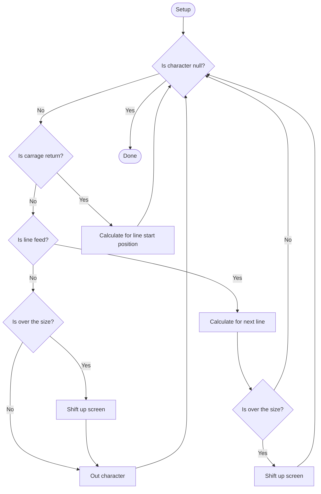

#### Implementation
- Color attribute
    - background = black
    - foreground = lightgray
- Calculate CR
    - `line_start_pos = curs_pos - (curs_pos % column)`
- Calculate LF
    - `next_line = curs_pos + column`

---

### `vga_outns`
#### Overview
Out string to screen base terminate number. Supports carriage return and line feed.

#### Parameters
1. `ub16 num`
1. `ub8 *str`

#### Requires
- `_vga_size`
- `_vga_last_row_off`

#### Modifies
- `N/A`

#### Returns
- `N/A`

#### Process Flow
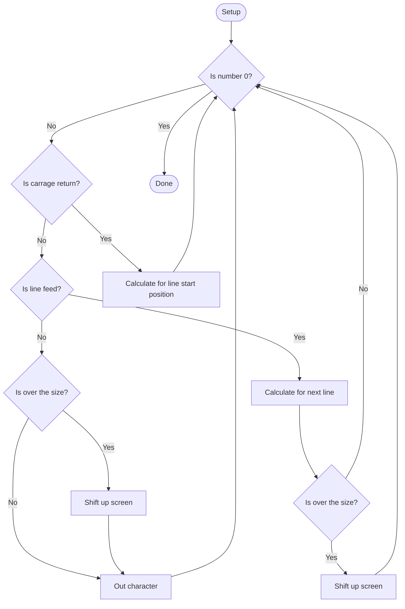

#### Implementation
- Color attribute
    - background = black
    - foreground = lightgray
- Calculate CR
    - `line_start_pos = curs_pos - (curs_pos % column)`
- Calculate LF
    - `next_line = curs_pos + column`

---

### `vga_shu`
#### Overview
Shift up for screen.
Support auto shift up and manual shift up.
Manual shift up if press page down key.

#### Parameters
1. `ub16 flag`

#### Requires
- `_vga_last_row_off`

#### Modifies
- `_vga_cnt`

#### Returns
- `N/A`

#### Process Flow
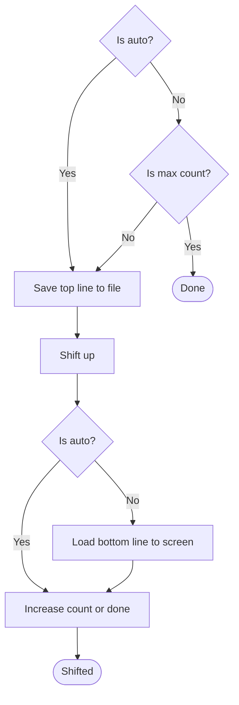

#### Implementation
- Color attribute
    - background = black
    - foreground = lightgray

---

### `vga_shd`
#### Overview
Shift down for screen.
Manual shift down if press page up key.

#### Parameters
- `N/A`

#### Requires
- `_vga_size`
- `_vga_last_row_off`

#### Modifies
- `_vga_cnt`

#### Returns
- `N/A`

#### Process Flow
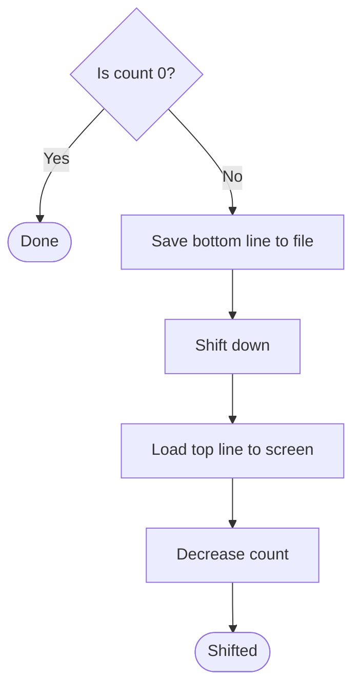

#### Implementation
- Color attribute
    - background = black
    - foreground = lightgray

---

### `_vga_sl_tb`
#### Overview
Save screen top line or bottom line to file and load file top line or bottom line to screen.
Support create mode if no exist file.

#### Parameters
1. `ub16 flag`

#### Requires
- `_vga_last_row_off`
- `_path_top`
- `_path_bottom`
- `_name_top`
- `_name_bottom`

#### Modifies
- `vga_top_cnt`
- `vga_bottom_cnt`

#### Returns
- `N/A`

#### Process Flow
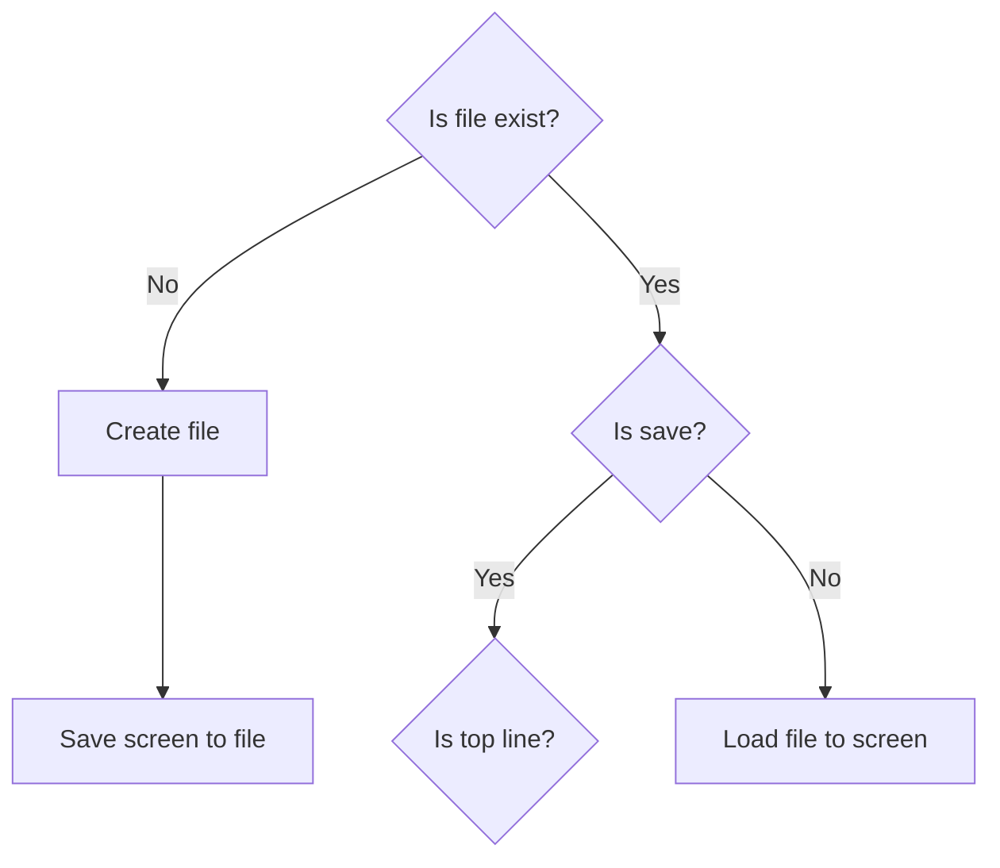

#### Implementation
- Color attribute
    - background = black
    - foreground = lightgray

---

## Notes
### Note VGA Size
- ROW: `TOTAL_ROW - 1` in screen
- COLUMN: Total column in screen
    - `ROW * COLUMN = last_row_offset`
    - `last_offset + COLUMN = total_size`
- Q. Why `ROW * COLUMN` is not total size?
- A. VGA address row have index value. But VGA address column have size value.
- Q. Why using `last_row_offset + COLUMN`?
- A. More faster than `(ROW + 1) * COLUMN`. And necessary need last offset. Already last row offset calculated. Just `last_row_offset + COLUMN` is total size.
- Q. Why `ROW * COLUMN` in `vga_last_row_off`?
- A. The `ROW * COLUMN` is size. But VGA using index, So start 0. So size value point the last row start offset.

---

## Terms
| Name | Description |
| --- | --- |
| VGA | Video Graphic Array |
| DISP | Display |
| CURS | Cursor |
| SHU | Shift Up |

---

## Reference Links
| Description | Link |
| --- | --- |
| Main document for driver | [docs: driver](/docs/drv/README.md) |
| External link: standard document for cursor | [OSDev: cursor](http://wiki.osdev.org/Text_Mode_Cursor) |

---

> Authors 2025-2026 Facooya and Fanone Facooya
