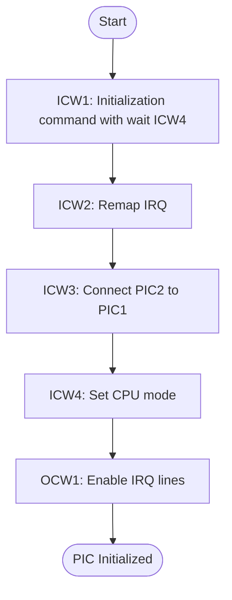
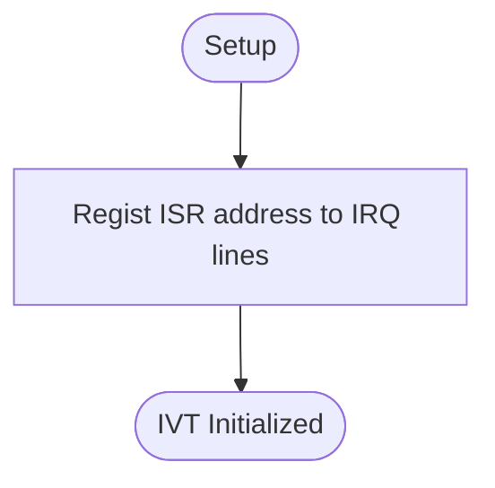

# Interrupt
## Overview
Initialization sequence: PIC (Programmable Interrupt Controller), IVT (Interrupt Vector Table), hardware.

---

## Table of Contents
- [Module Map](#module-map)
- [Register Map](#register-map)
- [Function Reference](#function-reference)
- - [`pic_init`](#pic_init)
- - [`ivt_init`](#ivt_init)
- [Notes](#notes)
- [Terms](#terms)
- [Reference Links](#reference-links)

---

## Module Map
| Description | Source Path | Docs Link |
| --- | --- | --- |
| Interrupt | `/int/interrupt.s` | [docs: interrupt](/docs/int/interrupt.md) |
| Interrupt header | `/inc/int.inc` | [docs: int header](/docs/inc/int_header.md) |

---

## Register Map
**Port**
| Name | Port | Byte | Mode |
| --- | --- | --- | --- |
| PIC1 command | 0x20 | 1 | OUT |
| PIC1 data | 0x21 | 1 | IO |
| PIC2 command | 0xA0 | 1 | OUT |
| PIC2 data | 0xA1 | 1 | IO |

**Command**
| Bit | Name | Value | Description |
| :---: | --- | --- | --- |
| 0 | ICW1 ICW4 | 0=false, 1=true | ICW4 will set |
| 4 | ICW1 initialization | 0=false, 1=true | ICW1 initialization  |

**Data**
| Bit | Name | Value | Description |
| :---: | --- | --- | --- |
| 0 | ICW4 MODE | 0=8080, 1=8086 | CPU mode |
| 2 | ICW3 PIC1 PIC2 | 0=disable, 1=enable | Interrup request line 2 |

**IMR of PIC1**
| Bit | Name | Value | Description |
| :---: | --- | --- | --- |
| 1 | IMR IRQ1 | 0=enable, 1=disable | Interrupt request line 1, For PS2 |
| 2 | IMR IRQ2 | 0=enable, 1=disable | Interrupt request line 2, Enable for PIC2 |

**IMR of PIC2**
| Bit | Name | Value | Description |
| :---: | --- | --- | --- |
| 0 | IMR IRQ8 | 0=enable, 1=disable | Interrupt request line 8, For RTC |
| 6 | IMR IRQ14 | 0=enable, 1=disable | Interrupt request line 14, For ATA |

---

## Function Reference
### `pic_init`
#### Overview
PIC initialization.

#### Parameters
- `N/A`

#### Requires
- `N/A`

#### Modifies
- `N/A`

#### Returns
- `N/A`

#### Process Flow

#### Reference Notes
| Description | Link |
| --- | --- |
| Why using data port | [docs: data port](#note-data-port) |
| Why IO wait | [docs: io wait](#note-io-wait) |
| Why remap | [docs: remap](#note-remap) |

---

### `ivt_init`
#### Overview
IVT initialization.

#### Parameters
- `N/A`

#### Requires
- `N/A`

#### Modifies
- `N/A`

#### Returns
- `N/A`

#### Process Flow

#### Reference Notes
| Description | Link |
| --- | --- |
| More IVT | [docs: note ivt](#note-ivt) |

---

## Notes
### Note Data Port
- Q. Why ICW2, ICW3, ICW4 commands using data port?
- A. It is parameter command type. ICW1 initialization command with ICW4 need, It will read data port 3 byte. ICW1 expect ICW2, ICW3, ICW4 sequence.
- Q. When using data port and command port?
- A. Data port list: ICW2, ICW3, ICW4, OCW1, Command port list: ICW1, OCW2, OCW3

### Note IO Wait
- Q. Why using IO wait?
- A. CPU not wait automadicaly. And don't know PIC process status. So just wait for pysical process done timing. More safely.
- Q. How many IO wait time?
- A. Approximately 1 micro second.

### Note remap
- Q. Why remap to 0x20?
- A. CPU using 0x00-0x1F, So remap to 0x20 for Fayos. This is base vector.

### Note IVT
- Q. Where is IVT memory?
- A. [0x0000:0x0000-0x0000:0x03FF] is IVT area. Fayos using [0x0000:0x0080-0x0000:0x00BF].
- Q. How to calculate interrupt vector?
- A. Formula: `(base_vactor + irq_line_num) * addr_size = vector_entry`.
Example for IRQ 1 in Fayos:
| Type | Value |
| --- | --- |
| Decimal | `(32 + 1) * 4 = 132` |
| Hexadecimal | `(0x20 + 0x01) * 0x04 = 0x84` |
So 0x84 is vector entry for IRQ 1.
- Q. What indicate?
- A. ISR address (seg:off) write in vector entry, `vector_entry+2:vector_entry -> isr_seg:isr_off`. Vector entry pointer to ISR.

---

## Terms
| Name | Description |
| --- | --- |
| EOI | End of Interrupt |
| ICW | Initialization Command Words |
| IMR | Interrup Mask Register |
| IRQ | Interrupt Request |
| IVT | Interrupt Vector Table |
| ISR | Interrupt Service Routine |
| OCW | Operation Command Words |
| PIC | Programmable Interrupt Controller |
| ENT | Entry |

---

## Reference Links
| Description | Link |
| --- | --- |
| Directory document for interrupt | [docs: int README](/docs/int/README.md) |
| ISR | [docs: isr](/docs/int/isr.md) |
| External link: pic standard document | [OSDev: pic](https://wiki.osdev.org/8259_PIC) |
| External link: interrupt vector table | [OSDev: ivt](https://wiki.osdev.org/Interrupt_Vector_Table) |

---

> Authors 2025-2026 Facooya and Fanone Facooya
