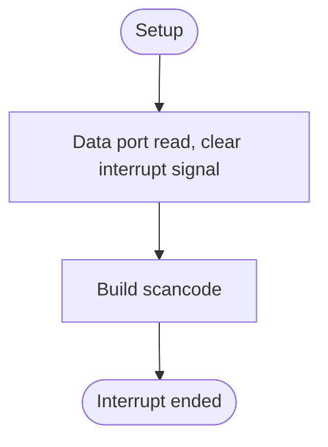
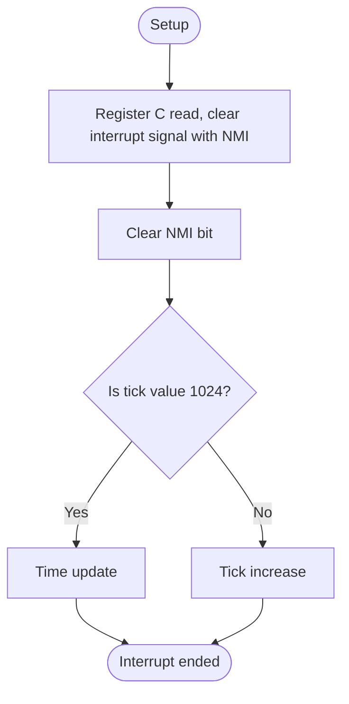
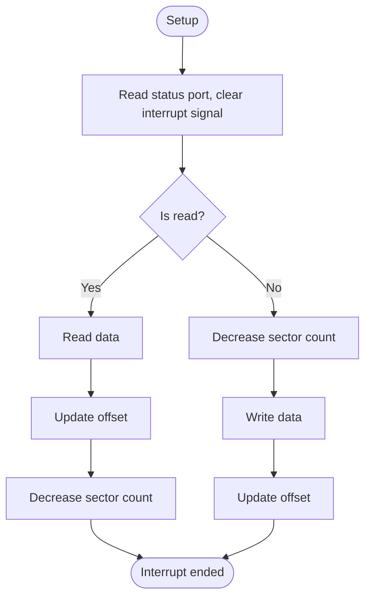

# ISR
## Overview
Interrupt service routine.

---

## Table of Contents
- [Module Map](#module-map)
- [Function Reference](#function-reference)
- - [`isr_ps2`](#isr_ps2)
- - [`isr_rtc`](#isr_rtc)
- - [`isr_ata`](#isr_ata)
- [Terms](#terms)
- [Reference Links](#reference-links)

## Module Map
| Description | Source Path | Docs Link |
| --- | --- | --- |
| ISR | `/int/isr.s` | [docs: isr](/docs/int/isr.md) |

---

## Function Reference
### `isr_ps2`
#### Overview
Invoke every bytes from key press or release scan code, using IRQ 1 line. Example for invoke situation: If release left arrow, 1. 0xF0 (break), 2. 0xE0 (extend), 3. 0x6B (normal). So invoke interrupt 3 times for one key release.

#### Parameters
- `N/A`

#### Requires
- `init_flag`

#### Modifies
- `scan_code`

#### Returns
- `N/A`

#### Process Flow

---

### `isr_rtc`
#### Overview
Invoke by Interrupt request, using IRQ 8 line.
Invoke every tick. `1024 ticks = 1 second`

#### Parameters
- `N/A`

#### Requires
- `init_flag`

#### Modifies
- `rtc_tick`
- `rtc_date`

#### Returns
- `N/A`

#### Process Flow

#### Reference Notes
| Description | Link |
| --- | --- |
| NMI | [docs: rtc note nmi](/docs/drv/rtc.md#note-nmi) |

---

### `isr_ata`
#### Overview
Invoke by interrupt request, using IRQ 14 line.
Invoke read/write sector.

#### Parameters
- `N/A`

#### Requires
- `init_flag`

#### Modifies
- `ata_buf`

#### Returns
- `N/A`

#### Process Flow

#### Reference Notes
| Description | Link |
| --- | --- |
| Why delay 400ns | [docs: ata delay 400ns](/docs/drv/ata.md#note-delay-400ns) |

---

## Terms
| Name | Description |
| --- | --- |
| EOI | End of Interrupt |
| IRQ | Interrupt Request |
| ISR | Interrupt Service Routine |
| PS2 | Personal System 2 |
| RTC | Real Time Clock |
| ATA | Advanced Technology Attachement |
| SC | Scancode |
| SCF | Scancode Flag |
| NMI | Non-Maskable Interrupt |

---

## Reference Links
| Description | Link |
| --- | --- |
| Directory document for interrupt | [docs: int README](/docs/int/README.md) |
| ISR | [docs: isr](/docs/int/isr.md) |
| Interrupt header | [docs: interrupt header](/docs/inc/int_header.md) |
| Interrupt | [docs: interrupt](/docs/int/interrupt.md) |
| PS2 driver | [docs: ps2 driver](/docs/drv/ps2.md) |
| RTC driver | [docs: rtc driver](/docs/drv/rtc.md) |
| ATA driver | [docs: ata driver](/docs/drv/ata.md) |

---

> Authors 2025-2026 Facooya and Fanone Facooya
